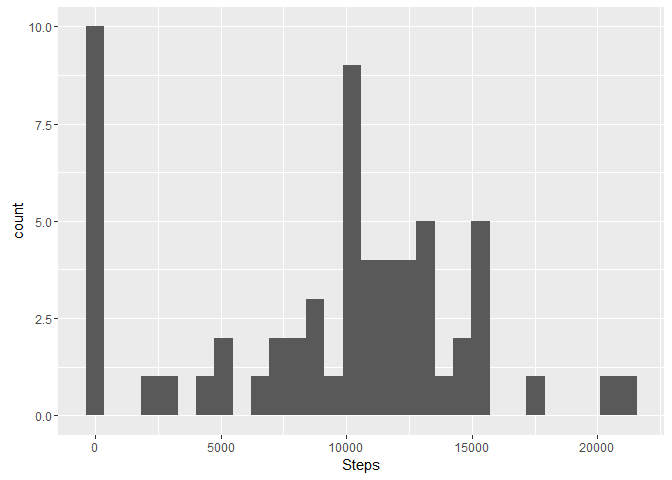
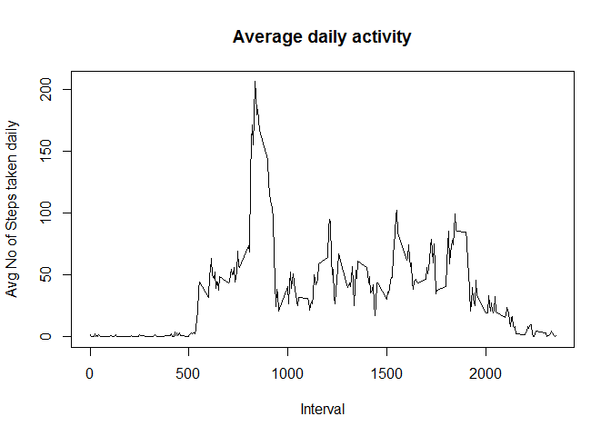
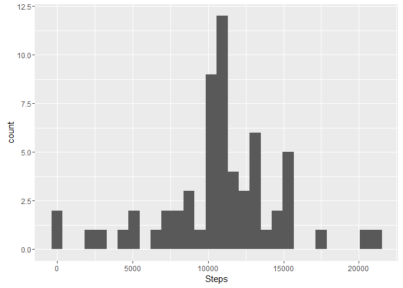
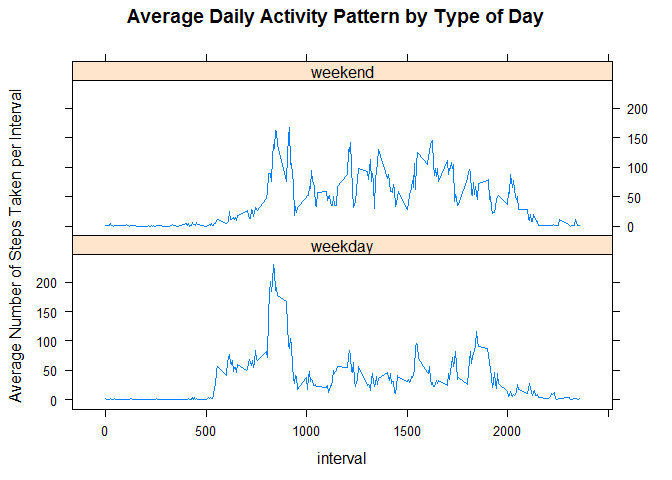

# Reproducible Research: Peer Assessment 1
Rakshith Nayak  
September 29, 2016  


## Activity Monitoring Analysis
This Report analyzes the data collected from a personal activity monitoring device collected at a 5 minute interval through the day during the months of October and November, 2012 from an anonymous individual.

###1.Loading and pre-processing the data 


```r
##Download and unzip the files in current working directory
download.file("https://d396qusza40orc.cloudfront.net/repdata%2Fdata%2Factivity.zip", "activity_monitor.zip")
unzip("./activity_monitor.zip")
activity_data<-read.csv("activity.csv",header = T)
```

### 2.Mean total number of steps taken per day?

Histogram of total number of steps taken per day

```r
library(ggplot2)

activity_daily_summary<-aggregate(activity_data$steps,by=list(activity_data$date),FUN=sum,na.rm=T)
names(activity_daily_summary)[names(activity_daily_summary) == "Group.1"] <- "Date"
names(activity_daily_summary)[names(activity_daily_summary) == "x"] <- "Steps"
ggplot(activity_daily_summary,aes(x=Steps))+geom_histogram(na.rm = T)
```

```
## `stat_bin()` using `bins = 30`. Pick better value with `binwidth`.
```

<!-- -->

Mean/Avg No of Steps taken per day is

```r
mean(activity_daily_summary$Steps)
```

```
## [1] 9354.23
```

Median of Steps taken per day is

```r
median(activity_daily_summary$Steps)
```

```
## [1] 10395
```

###3.Average daily activity pattern

```r
activity_interval_summary<-aggregate(activity_data$steps,by=list(activity_data$interval),FUN="mean",na.rm=T)
names(activity_interval_summary)[names(activity_interval_summary) == "Group.1"] <- "interval"
names(activity_interval_summary)[names(activity_interval_summary) == "x"] <- "steps"

plot(x= activity_interval_summary$interval,y=activity_interval_summary$steps,type = "l",xlab = "Interval",ylab="Avg No of Steps taken daily",main = "Average daily activity")
```

<!-- -->

Maximimun steps are taken during the interval

```r
activity_interval_summary[which.max(activity_interval_summary$steps),"interval"]
```

```
## [1] 835
```


###4.Imputing missing values
Imputing strategy:NA values are imputed by taking an average of the intervals for all days.


```r
library(dplyr)
```

```
## 
## Attaching package: 'dplyr'
```

```
## The following objects are masked from 'package:stats':
## 
##     filter, lag
```

```
## The following objects are masked from 'package:base':
## 
##     intersect, setdiff, setequal, union
```

```r
activity_data_imputed<-activity_data %>% group_by(interval)%>%mutate(steps=ifelse(is.na(steps),mean(steps,na.rm=T),steps))

activity_daily_summary_imputed<-aggregate(activity_data_imputed$steps,by=list(activity_data_imputed$date),FUN=sum,na.rm=T)
names(activity_daily_summary_imputed)[names(activity_daily_summary_imputed) == "Group.1"] <- "Date"
names(activity_daily_summary_imputed)[names(activity_daily_summary_imputed) == "x"] <- "Steps"
ggplot(activity_daily_summary_imputed,aes(x=Steps))+geom_histogram(na.rm = T)
```

```
## `stat_bin()` using `bins = 30`. Pick better value with `binwidth`.
```

<!-- -->

Mean/Avg No of Steps taken per day is

```r
mean(activity_daily_summary_imputed$Steps)
```

```
## [1] 10766.19
```

Median of Steps taken per day is

```r
median(activity_daily_summary_imputed$Steps)
```

```
## [1] 10766.19
```

###5.Activity patterns between weekdays and weekends

```r
library(lubridate)
```

```
## 
## Attaching package: 'lubridate'
```

```
## The following object is masked from 'package:base':
## 
##     date
```

```r
activity_data_imputed$Day<-wday(activity_data_imputed$date,label=TRUE)

activity_data_imputed$daytype<- activity_data_imputed$Day
levels(activity_data_imputed$daytype) <- list(
    weekday = c("Mon", "Tues", "Wed", "Thurs", "Fri"),
    weekend = c("Sun", "Sat"))

activity_data_by_day<-activity_data_imputed%>%group_by(daytype,interval)%>%summarise(averageSteps=mean(steps,na.rm=T))
library(lattice)
xyplot(averageSteps~interval|daytype,data = activity_data_by_day,type='l',layout=(c(1,2)),main="Average Daily Activity Pattern by Type of Day", ylab="Average Number of Steps Taken per Interval",xlab = "interval")
```

<!-- -->


